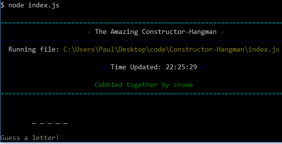

# Constructor-Hangman  V.1.0.0

Constructor-Hangman is yet another edition of the world-famous hangman word-guessing game. This one, however, is terminal based and thereby reminiscent of the good ol' days. 

## Getting Started

To use, just clone down the repo, install the npm modules, and enjoy.

### Prerequisites

Constructor-Hangman was built and tested with the following nodeJS NPM packages:

| NPM Package     | Version |
| --------------- | ------- |
| colors          | 1.1.2   |
| prompt          | 1.0.0   |
| simple-banner   | 1.0.7   |
| request   			| 2.83.0  |

### Installing

1. Clone the repo to your system.

1. Run `npm install`

### Usage

Usage is `node index.js`

## Authors

* **Paul Rowe** - *Initial work* - [zrowe](https://github.com/zrowe)

## License

This project is licensed under the MIT License - see the [LICENSE.md](LICENSE.md) file for details

## Acknowledgments

* UC Berkeley Coding BootCamp
* Trilogy
